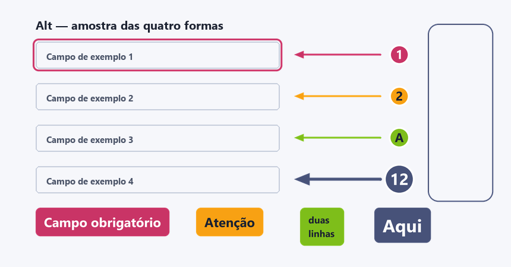

# Alt

**Soft Smart Screenshot**

Ferramenta de print anotado para Windows. Quatro formas: **seta**, **callout
redondo** com número ou letra dentro, **marcador retangular** de cantos
arredondados, e **etiqueta de texto** com fundo preenchido.

Fica na bandeja do sistema e abre com **Ctrl + Print Screen**.

Existe porque as ferramentas do gênero fazem trinta coisas e eu queria quatro, com
uma paleta fixa, para anotar prints de documentação sem ficar escolhendo estilo a
cada captura.



## Instalar

Baixe ou clone, e rode o executável em `Programa\Alt.exe`. Não precisa de Python.

Se o repositório vier sem a pasta `Programa` — ela não é versionada — gere o
executável:

```
pip install pyinstaller
build.cmd
```

Ou rode direto pelo Python, sem compilar:

```
pip install -r requirements.txt
pythonw alt.py
```

## Ligar

Clique duas vezes em **`Programa\Alt.exe`**. Nenhuma janela abre: o Alt vai para a
bandeja, com um ícone de callout magenta, e um balão avisa qual atalho ficou
valendo.

### O ícone na bandeja

| Ação | O que faz |
|---|---|
| clique | captura, igual ao atalho |
| clique direito | menu: *Capturar agora* · *Abrir pasta dos prints* · *Sair* |

O ícone volta sozinho se o `explorer.exe` reiniciar. Se o Windows o esconder, ele
está na setinha de estouro da bandeja — arraste para a área visível.

### Subir junto com o Windows

`Win + R`, digite `shell:startup`, Enter. Arraste o `Programa\Alt.exe` para essa
pasta com **Ctrl + Shift** pressionado, para criar atalho em vez de mover o
executável.

## Usar

1. **Ctrl + Print Screen** congela a tela e escurece.
2. **Arraste** para escolher a área. `Enter` pega a tela inteira, `Esc` cancela.
3. O editor abre com a área recortada.

### Ferramentas

| Tecla | Ferramenta | Como usar |
|---|---|---|
| `A` | Seta | arraste do rabo para a ponta |
| `C` | Callout | clique onde quer o círculo; o rótulo avança sozinho |
| `R` | Marcador | arraste para dimensionar o retângulo, que fica só de contorno |
| `T` | Texto | clique e digite; a caixa cresce junto e tem fundo preenchido |
| `V` | Selecionar | clique numa forma para mover, redimensionar ou apagar |

### Atalhos

| Atalho | O que faz |
|---|---|
| `Ctrl + C` | copia o resultado para a área de transferência, pronto para colar |
| `Ctrl + S` | salva como PNG ou JPG |
| `Ctrl + Z` | desfaz |
| `Del` | apaga a forma selecionada |
| `Esc` | fecha o editor |

### A etiqueta de texto

Clique com a ferramenta `T` e digite. A caixa tem **fundo preenchido** na cor
escolhida e cresce conforme o texto — nunca corta e nunca deixa a letra encostar na
borda.

- `Enter` quebra linha; a caixa cresce na altura também.
- `Esc` termina a digitação. Etiqueta vazia é descartada.
- `Backspace` apaga letra durante a digitação.
- Os três botões `T16` `T22` `T30` na barra escolhem o tamanho da fonte.
- Com a ferramenta `V`, a alça no canto inferior direito muda o tamanho da fonte e
  a caixa acompanha. Clicar e digitar continua o texto de onde parou.
- A tinta segue o mesmo critério do callout numérico: branca no magenta e no navy,
  grafite no laranja e no verde.

Ela **não substitui** o marcador `R`: aquele é de contorno, para circundar um campo
da tela; esta é de fundo cheio, para escrever em cima.

### Detalhes que ajudam

- **Rótulo do callout:** o contador avança a cada clique. Alterne entre `1 2 3` e
  `A B C` na barra. Com um callout selecionado (ferramenta `V`), **digitar troca o
  rótulo** — dá para pôr `1a`, `12`, o que precisar. Backspace apaga.
- **Redimensionar:** com a ferramenta `V`, clique na forma e arraste as alças
  brancas. A seta tem alça nas duas pontas, o marcador nos quatro cantos, e o
  callout tem uma alça que muda o diâmetro.
- **Cor e espessura** valem para a próxima forma. Com uma forma selecionada, mudar
  a cor ou a espessura aplica nela.
- **Tinta do rótulo:** escolhida sozinha pela luminosidade da cor. Branco no
  magenta e no navy, grafite no laranja e no verde, que é onde branco não lê.
- **O anel do callout é sempre branco**, de 3 px, como no protótipo que gerou os
  prints do manual. É ele que solta o callout de um fundo escuro ou da própria cor.
  Sobre fundo quase branco ele desaparece — isso é esperado.
- **O círculo do callout cresce com o rótulo.** `1` fica em 17 px de raio, `12` vai a
  21, `MM` a 28. A alça continua mandando: ela define o mínimo, e o círculo só passa
  disso quando o texto não caberia.
- **Resolução:** se o recorte for maior que a tela, o editor exibe reduzido, mas o
  arquivo salvo e o que vai para a área de transferência saem em **tamanho real**.
  As formas vivem em coordenadas de imagem, não de tela.

### Paleta

| Cor | Hex |
|---|---|
| Magenta (padrão) | `#C93466` |
| Laranja | `#F8A113` |
| Verde | `#7EBE1A` |
| Navy | `#475279` |

## Como o atalho é ouvido

`Ctrl + Print Screen` é ouvido por **gancho de teclado de baixo nível**
(`WH_KEYBOARD_LL`), e não pelo `RegisterHotKey` do Windows.

A razão é concreta: para o Print Screen, o `RegisterHotKey` **aceita o registro e
devolve sucesso, mas o evento nunca chega** — programas com gancho de baixo nível
(antivírus, OneDrive, a captura do próprio Windows) consomem a tecla antes do
despachante de atalhos. Registro não é entrega, e é por isso que o `--autoteste`
dispara uma tecla sintética e confirma a entrega, em vez de só testar o registro.

O gancho também **engole** a combinação, para a captura do Windows não disparar
junto.

Se o gancho não puder ser instalado, o Alt cai numa reserva pelo mecanismo antigo:
`Ctrl + Alt + A`, depois `Ctrl + Shift + Print Screen`. O balão da bandeja diz qual
ficou valendo.

Se nada disparar, a causa quase certa é **outra instância do Alt já rodando** — só
uma pode ter o gancho. Clique direito no ícone da bandeja e *Sair* antes de abrir de
novo.

## Se o antivírus barrar

Executável sem assinatura digital costuma ser barrado por heurística. O Kaspersky,
em particular, bloqueia também o `Alt.vbs` quando aberto pelo Explorer — foi por
isso que o executável passou a existir.

O build é montado **em pasta**, e não em arquivo único, de propósito: arquivo único
se autodescompacta no `%TEMP%` a cada abertura, comportamento que a heurística
marca. Se ainda assim for barrado, adicione a pasta `Programa` — e só ela — às
exclusões do antivírus.

## Diagnóstico

```
Programa\Alt.exe --autoteste
```

Verifica consciência de DPI, captura em multi-monitor, área de transferência, e
**dispara uma tecla sintética para confirmar que o `Ctrl + Print Screen` chega de
fato** — não só que registrou. Salva também uma amostra das quatro formas. É o que
responde "por que não funcionou" sem chute.

Outros modos:

```
pythonw alt.py              fica na bandeja esperando o atalho
pythonw alt.py --painel     bandeja mais um painelzinho, para depurar
python  alt.py --capturar   abre a seleção de área agora
python  alt.py --autoteste  o mesmo diagnóstico acima
```

## Como está montado

Arquivo único, `alt.py`, em cinco partes:

| Parte | O que faz |
|---|---|
| Captura | `ImageGrab` sobre o desktop virtual inteiro, com consciência de DPI por monitor |
| `SelecaoDeArea` | tela cheia com o print congelado; quatro faixas escurecidas em volta do recorte |
| `Editor` | canvas com as formas em coordenadas de imagem; exporta pelo Pillow, não pelo canvas |
| `GanchoDeTeclado` | `WH_KEYBOARD_LL`, que é o único jeito confiável de ouvir o Print Screen |
| `Bandeja` | ícone e gancho no mesmo fio, porque dependem do mesmo laço de mensagens do Windows |

Quatro decisões que valem saber ao mexer:

- **A bandeja e o atalho moram no mesmo fio.** O `RegisterHotKey` entrega o
  `WM_HOTKEY` na janela que registrou, e o `Shell_NotifyIcon` entrega o clique do
  ícone na mesma janela. Nada de `tkinter` nesse fio: os avisos vão para uma fila e
  o fio principal consome.
- **O desenho final é feito pelo Pillow**, não capturando o canvas. É o que garante
  que o arquivo saia em resolução cheia mesmo quando o editor exibe reduzido.
- **Toda forma é desenhada por superamostragem 4×**, cada uma numa camada RGBA do
  tamanho dela, reduzida com LANCZOS. O `ImageDraw` não suaviza borda: círculo e
  diagonal saem em escada, e o anel branco de 3 px do callout praticamente
  desaparecia. A camada é do tamanho da forma, não da imagem, para não estourar
  memória — uma camada 4× de um print inteiro passaria de 280 MB.
- **O raio do callout acompanha o rótulo, e o tamanho da fonte vem do raio da alça.**
  Se a fonte viesse do raio efetivo, crescer o círculo cresceria a letra, que
  cresceria o círculo — realimentação sem fim. Assim a alça define o tamanho
  desejado e o círculo só cresce além disso quando o rótulo não caberia.
- **A caixa da etiqueta de texto é medida pelo maior entre a métrica do Pillow e a
  do tkinter.** O Pillow desenha o arquivo e o tkinter desenha o editor; medir só
  por um deles corta o texto no outro.
- **A referência do callback do gancho tem de ficar viva.** Se o Python coletar o
  objeto, o Windows chama memória liberada e o processo morre sem aviso.
- **O ícone das janelas é aplicado por dois caminhos.** Toda janela `tkinter` nasce
  com a pena do Tcl/Tk. O `iconbitmap(default=...)` vale para as Toplevel criadas
  depois, mas o Tk o grava na classe da janela e não há como ler de volta; o
  `WM_SETICON` é direto no identificador e é o que se pode conferir.

### Onde as coisas ficam

| O quê | Onde |
|---|---|
| Executável | `Programa\Alt.exe` (não versionado) |
| Config e amostra, compilado | `%LOCALAPPDATA%\Alt\` |
| Config e amostra, pelo Python | ao lado do `alt.py` |
| Prints salvos, padrão | `%USERPROFILE%\Pictures\Alt\` |

## Requisitos

- Windows 10 ou 11
- Para rodar o executável: nada
- Para rodar o código: Python 3.10+, `pillow`, `pywin32` (o `tkinter` vem com o
  Python no Windows)
- Para compilar: `pyinstaller`

## Licença

MIT. Veja `LICENSE`.
